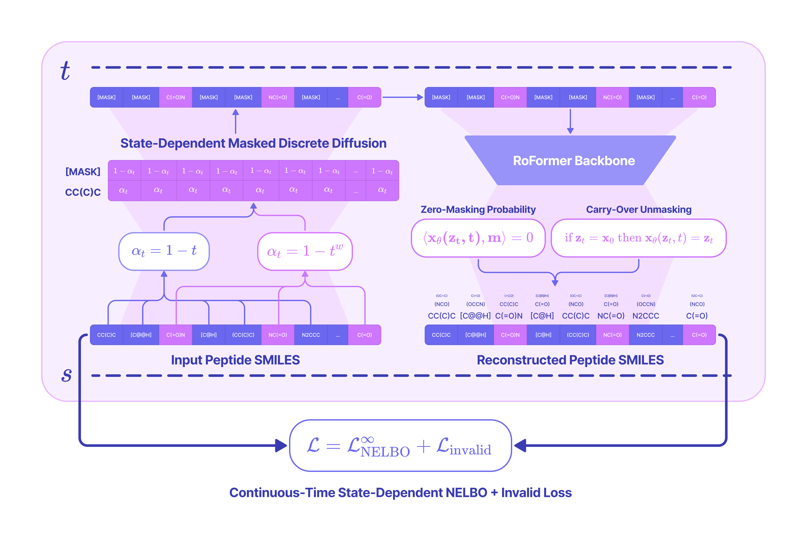

# PepTune: *De Novo* Generation of Therapeutic Peptides with Multi-Objective-Guided Discrete Diffusion

## ICML 2025 Submission
This is for reviewer use only. 

## Abstract
Peptide therapeutics, a major class of medicines, have achieved remarkable success across diseases like diabetes and cancer, with landmark examples such as GLP-1 receptor agonists revolutionizing the treatment of type-2 diabetes and obesity. Despite their success, designing peptides that satisfy multiple conflicting objectives, such as binding affinity, solubility, and membrane permeability, remains a major challenge. Classical drug development and target structure-based design methods are ineffective for such tasks, as they fail to optimize global functional properties critical for therapeutic efficacy. Existing generative frameworks are largely limited to continuous spaces, unconditioned outputs, or single-objective guidance, making them unsuitable for discrete sequence optimization across multiple properties. To address this, we present **PepTune**, a multi-objective discrete diffusion model for the simultaneous generation and optimization of therapeutic peptide SMILES. Built on the Masked Discrete Language Model (MDLM) framework, PepTune ensures valid peptide structures with state-dependent masking schedules and penalty-based objectives. To guide the diffusion process, we propose a Monte Carlo Tree Search (MCTS)-based strategy that balances exploration and exploitation to iteratively refine Pareto-optimal sequences. MCTS integrates classifier-based rewards with search-tree expansion, overcoming gradient estimation challenges and data sparsity inherent to discrete spaces. Using PepTune, we generate diverse, chemically-modified peptides optimized for multiple therapeutic properties, including target binding affinity, membrane permeability, solubility, hemolysis, and non-fouling characteristics on various disease-relevant targets. In total, our results demonstrate that MCTS-guided discrete diffusion is a powerful and modular approach for multi-objective sequence design in discrete state spaces.

### We build our training framework on top of the [Masked Discrete Language Model](https://huggingface.co/kuleshov-group/mdlm-owt) framework.

### We optimize desired therapeutic properties of generated sequences based on a Monte Carlo Tree Search 

